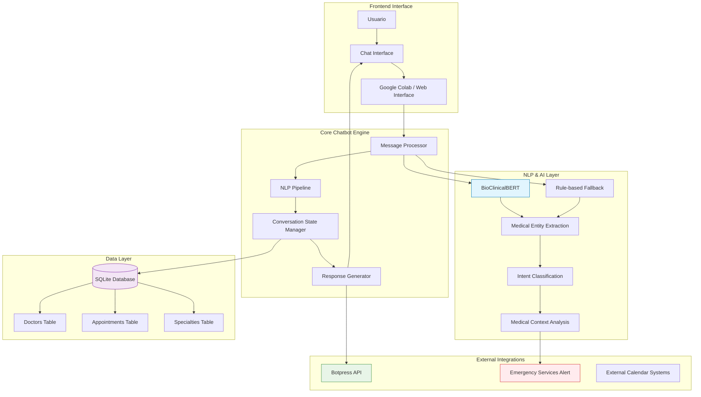
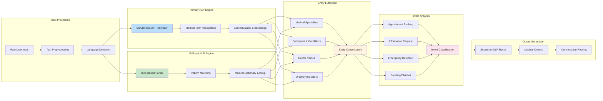
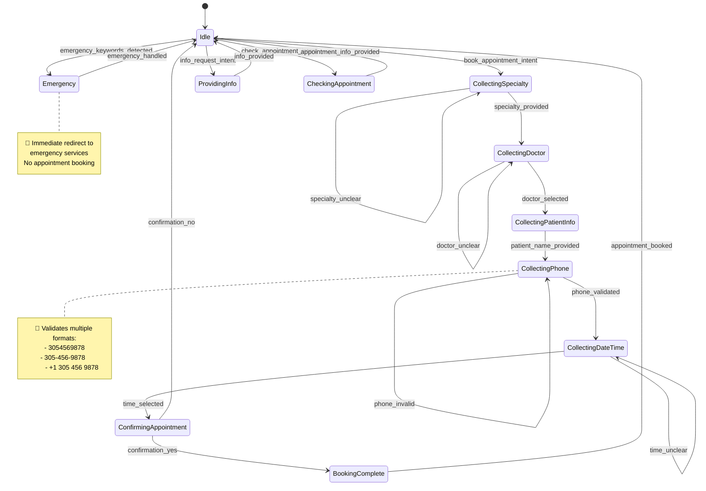
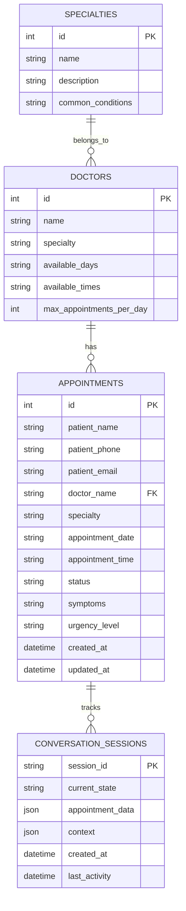
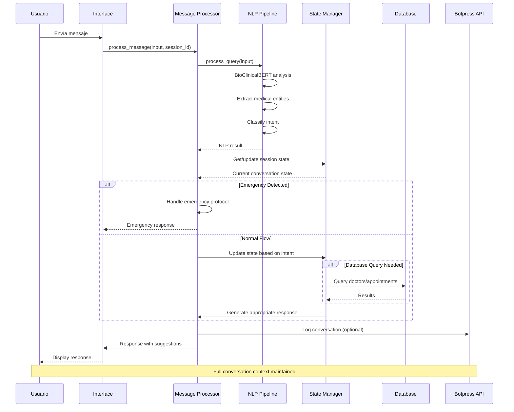
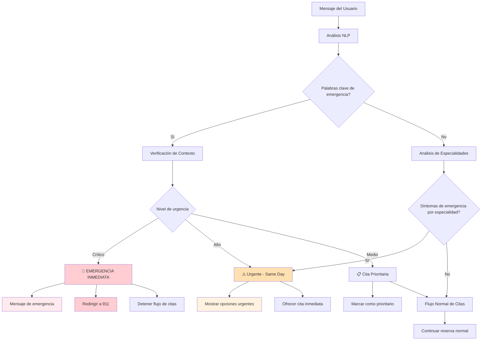
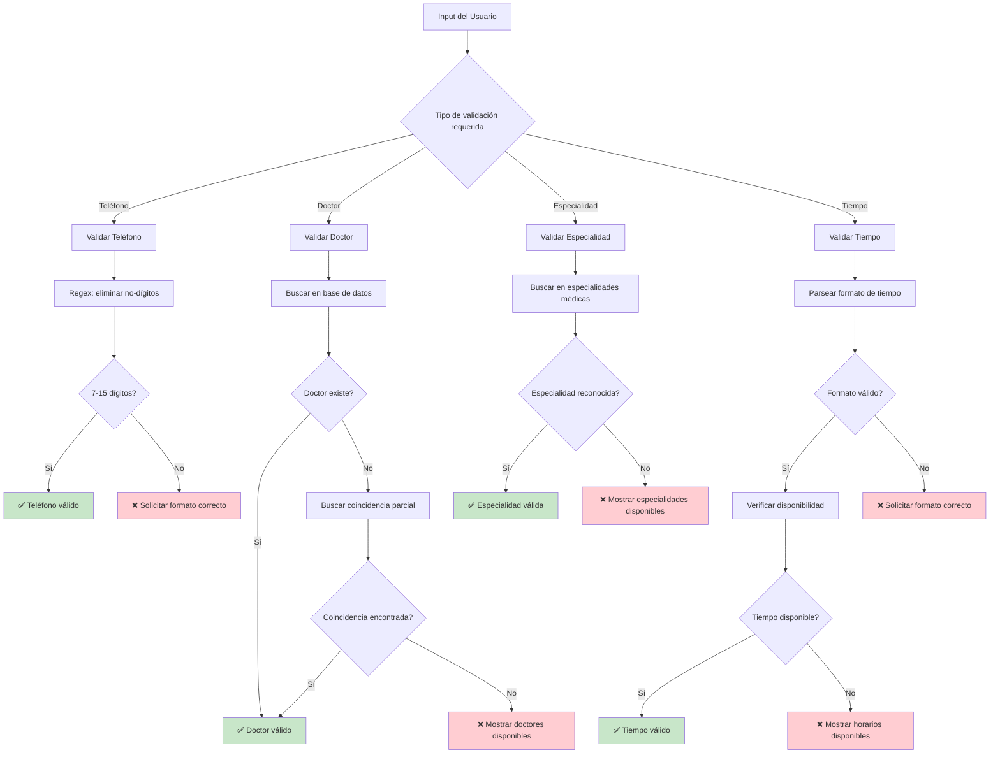
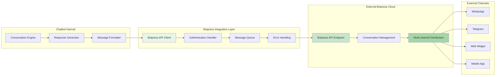
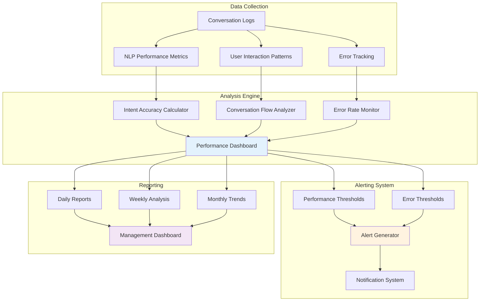

# 🏗️ Diagramas de Arquitectura - Medical Chatbot

## 📋 Vista General del Sistema

## 🧠 Arquitectura del NLP Pipeline

## 🔄 Flujo de Estados de Conversación

## 🗄️ Modelo de Datos

## 🎯 Flujo de Procesamiento de Mensajes

## 🚨 Sistema de Detección de Emergencias

## 📱 Validación de Entrada

## 🔗 Integración con Botpress

## 📊 Métricas y Monitoreo

---

## 🎯 Puntos Clave de la Arquitectura

### 1. **Modularidad**
- Cada componente tiene responsabilidades específicas
- Fácil mantenimiento y expansión
- Intercambio de componentes sin afectar el sistema

### 2. **Redundancia Inteligente**
- BioClinicalBERT como motor principal
- Sistema basado en reglas como respaldo
- Garantiza funcionamiento continuo

### 3. **Escalabilidad**
- Base de datos SQLite para desarrollo
- Fácil migración a PostgreSQL/MySQL
- Arquitectura preparada para múltiples instancias

### 4. **Seguridad Médica**
- Detección proactiva de emergencias
- Validación estricta de datos médicos
- Logging completo para auditorías

---

*Diagramas generados para Medical Chatbot v1.0*