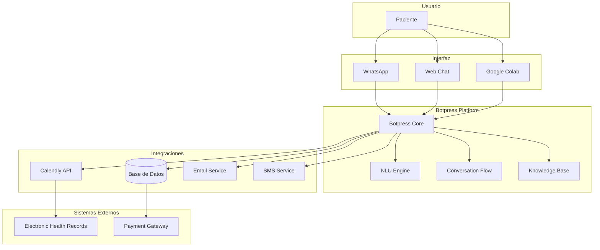
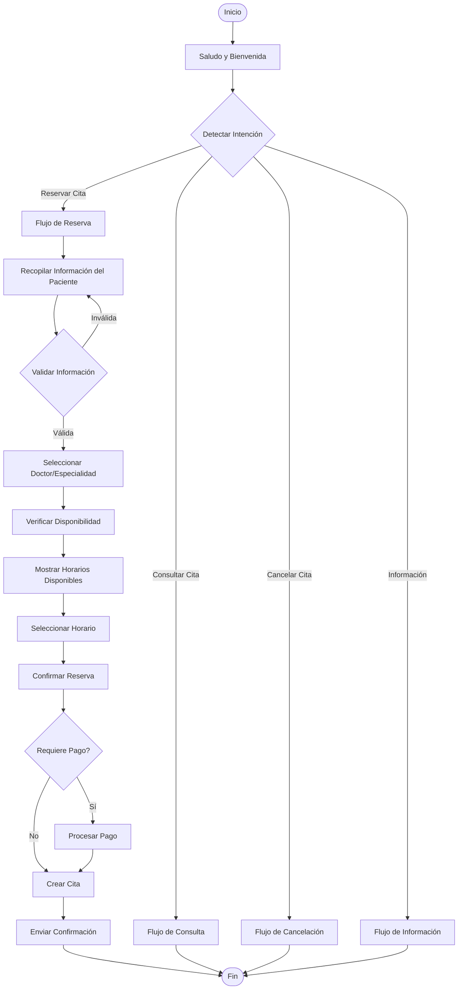
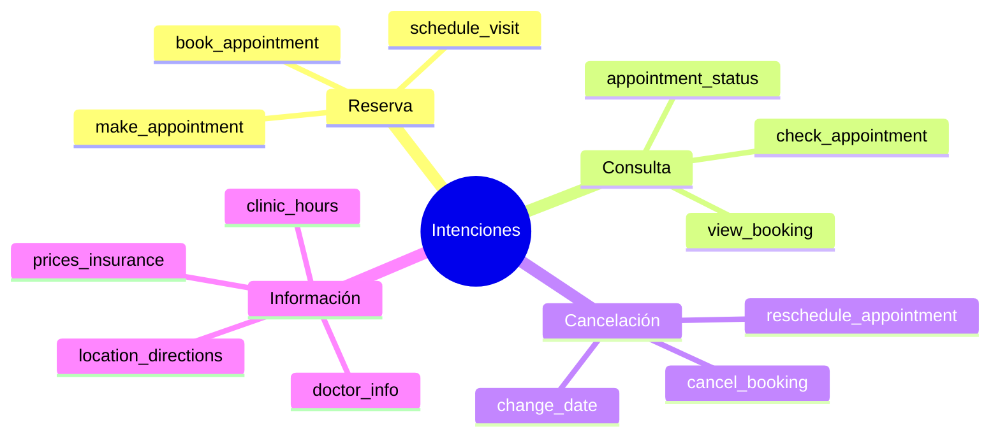
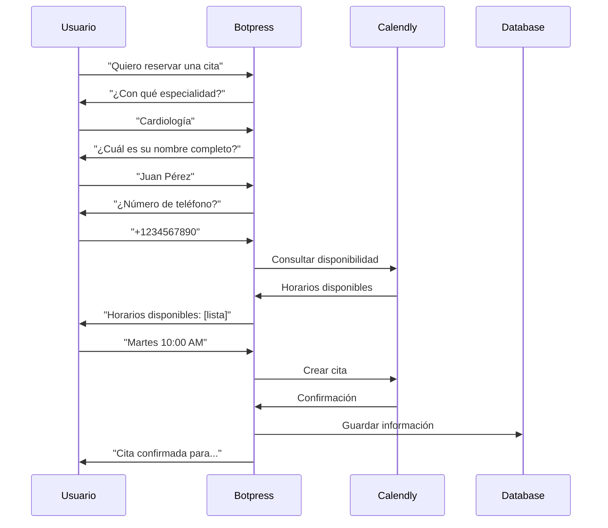
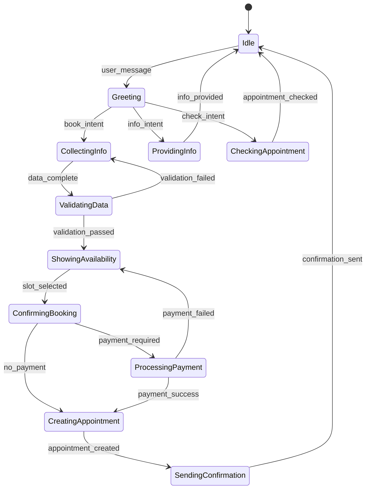
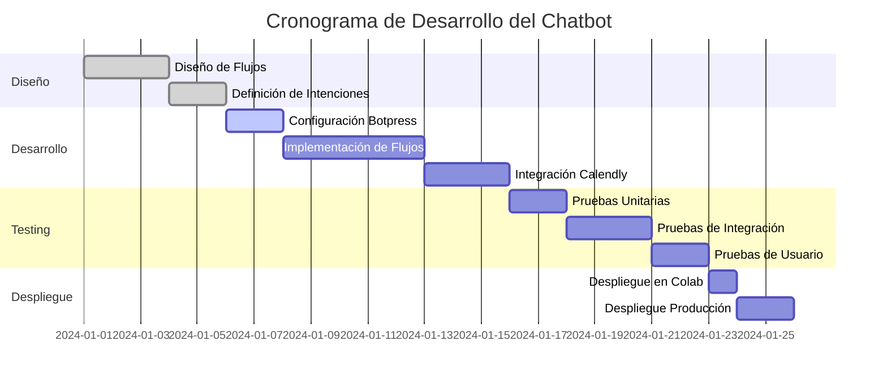

# Chatbot para Reservas de Citas Médicas - Documento de Diseño

## 1. Alcance y Requerimientos del Chatbot

### 1.1 Objetivo Principal
Desarrollar un chatbot inteligente para la reserva de citas médicas que permita a los pacientes:
- Programar citas de manera autónoma
- Consultar disponibilidad en tiempo real
- Recibir confirmaciones y recordatorios
- Reagendar o cancelar citas existentes

### 1.2 Objetivos de Aprendizaje
- Aprender desarrollo de chatbots con Botpress
- Implementar integración con sistemas de calendario (Calendly)
- Crear flujos conversacionales efectivos
- Desplegar en Google Colab inicialmente

### 1.3 Requerimientos Funcionales
- **RF001**: El chatbot debe permitir reservar citas médicas
- **RF002**: Debe mostrar disponibilidad de doctores y horarios
- **RF003**: Debe solicitar información básica del paciente
- **RF004**: Debe confirmar la cita por mensaje
- **RF005**: Debe permitir reagendar citas existentes
- **RF006**: Debe enviar recordatorios automáticos

### 1.4 Requerimientos No Funcionales
- **RNF001**: Cumplimiento con regulaciones de privacidad (GDPR, HIPAA)
- **RNF002**: Tiempo de respuesta menor a 3 segundos
- **RNF003**: Disponibilidad 24/7
- **RNF004**: Interfaz multiidioma (español/inglés)
- **RNF005**: Compatibilidad con múltiples plataformas

## 2. Arquitectura del Sistema

### 2.1 Diagrama de Arquitectura General



### 2.2 Componentes del Sistema

#### 2.2.1 Botpress Core
- Motor principal del chatbot
- Gestión de sesiones y contexto
- Procesamiento de mensajes
- Enrutamiento de conversaciones

#### 2.2.2 NLU Engine (Natural Language Understanding)
- Reconocimiento de intenciones
- Extracción de entidades
- Análisis de sentimientos
- Clasificación de consultas

#### 2.2.3 Conversation Flow
- Flujos de diálogo estructurados
- Gestión de estados de conversación
- Validación de inputs
- Manejo de errores

#### 2.2.4 Knowledge Base
- Información sobre doctores y especialidades
- Horarios de atención
- Precios y seguros aceptados
- FAQs médicas

## 3. Diseño del Flujo Conversacional

### 3.1 Flujo Principal de Reserva de Citas



### 3.2 Intenciones y Entidades

#### 3.2.1 Intenciones Principales


#### 3.2.2 Entidades Clave
- **@doctor**: Nombres de doctores
- **@specialty**: Especialidades médicas
- **@date**: Fechas de citas
- **@time**: Horarios específicos
- **@patient_info**: Datos del paciente
- **@appointment_id**: Identificadores de citas

## 4. Implementación Técnica

### 4.1 Stack Tecnológico
- **Plataforma**: Botpress (Open Source)
- **NLU**: Botpress NLU + LLMz
- **Calendario**: Calendly API
- **Base de Datos**: PostgreSQL
- **Desarrollo**: Google Colab (inicial)
- **Despliegue**: Botpress Cloud

### 4.2 Configuración de Botpress en Google Colab

```python
# Instalación y configuración inicial
!npm install -g @botpress/cli
!pip install botpress-sdk

# Configuración del proyecto
import os
import json
from botpress_sdk import Client

# Configuración de credenciales
BOTPRESS_TOKEN = "your_token_here"
CALENDLY_TOKEN = "your_calendly_token"

# Inicialización del cliente
client = Client(token=BOTPRESS_TOKEN)
```

### 4.3 Estructura de Intenciones

```json
{
  "intents": [
    {
      "name": "book_appointment",
      "utterances": [
        "Quiero reservar una cita",
        "Necesito agendar con un doctor",
        "Programar consulta médica"
      ],
      "slots": [
        {
          "name": "specialty",
          "entity": "@specialty"
        },
        {
          "name": "preferred_date",
          "entity": "@date"
        }
      ]
    }
  ]
}
```

## 5. Flujos de Conversación Detallados

### 5.1 Flujo de Recopilación de Información



### 5.2 Estados de Conversación



## 6. Base de Conocimiento

### 6.1 Información Médica
- **Especialidades**: Cardiología, Dermatología, Pediatría, Ginecología, etc.
- **Doctores**: Perfiles, especialidades, horarios, idiomas
- **Servicios**: Consultas, exámenes, procedimientos
- **Precios**: Tarifas por consulta, seguros aceptados

### 6.2 Información Operativa
- **Horarios**: Días y horas de atención
- **Ubicaciones**: Direcciones, mapas, transporte
- **Políticas**: Cancelaciones, reagendamiento, pagos
- **Contacto**: Teléfonos de emergencia, emails

## 7. Integración y Despliegue

### 7.1 Calendario de Desarrollo



### 7.2 Plataformas de Despliegue

#### 7.2.1 Google Colab (Fase 1)
- Desarrollo y pruebas iniciales
- Prototipado rápido
- Validación de conceptos

#### 7.2.2 Web (Fase 2)
- Interfaz web responsive
- Embed en sitio del hospital
- Análíticas integradas

#### 7.2.3 WhatsApp (Fase 3)
- Integración con WhatsApp Business
- Notificaciones automáticas
- Mayor alcance de pacientes

## 8. Criterios de Evaluación

### 8.1 Funcionalidad del Chatbot (40%)
- ✅ Reserva exitosa de citas
- ✅ Manejo de múltiples especialidades
- ✅ Validación de datos del paciente
- ✅ Integración con sistema de calendario
- ✅ Confirmaciones automáticas

### 8.2 Flujo Conversacional (30%)
- ✅ Respuestas naturales y coherentes
- ✅ Manejo de errores y excepciones
- ✅ Recuperación de contexto
- ✅ Escalamiento a humanos cuando sea necesario

### 8.3 Integración y Despliegue (20%)
- ✅ Funcionalidad en Google Colab
- ✅ APIs funcionando correctamente
- ✅ Base de datos actualizada
- ✅ Notificaciones por email/SMS

### 8.4 Presentación y Demo (10%)
- ✅ Demostración en vivo
- ✅ Documentación clara
- ✅ Video explicativo
- ✅ Casos de uso cubiertos

## 9. Plan de Implementación

### 9.1 Fase 1: Configuración Inicial (Semana 1)
1. Configurar cuenta de Botpress
2. Instalar dependencias en Google Colab
3. Crear primer flujo básico
4. Integrar con Calendly

### 9.2 Fase 2: Desarrollo Core (Semana 2-3)
1. Implementar intenciones principales
2. Crear flujos de conversación
3. Configurar base de conocimiento
4. Pruebas unitarias

### 9.3 Fase 3: Integración (Semana 4)
1. Conectar APIs externas
2. Implementar notificaciones
3. Pruebas de integración
4. Optimización de rendimiento

### 9.4 Fase 4: Testing y Despliegue (Semana 5)
1. Pruebas de usuario
2. Ajustes finales
3. Documentación
4. Despliegue en producción

## 10. Consideraciones de Seguridad y Privacidad

### 10.1 Cumplimiento Normativo
- **GDPR**: Consentimiento explícito para datos personales
- **HIPAA**: Protección de información médica
- **SOC 2**: Controles de seguridad organizacional

### 10.2 Medidas de Seguridad
- Encriptación de datos en tránsito y reposo
- Autenticación de dos factores
- Logs de auditoría
- Respaldo automático de datos

### 10.3 Manejo de Datos Sensibles
- Minimización de datos recopilados
- Anonimización cuando sea posible
- Políticas claras de retención
- Procedimientos de eliminación segura

## 11. Conclusiones y Próximos Pasos

Este documento establece las bases para el desarrollo de un chatbot médico robusto y funcional usando Botpress. La implementación seguirá un enfoque iterativo que permita aprendizaje continuo y mejoras basadas en feedback de usuarios reales.

### Próximos Pasos:
1. ✅ Revisar y aprobar el diseño
2. 🔄 Configurar entorno de desarrollo
3. ⏳ Comenzar implementación en Google Colab
4. ⏳ Realizar pruebas piloto
5. ⏳ Iterar basado en resultados

---

*Documento creado para el proyecto de chatbot de reservas médicas - Versión 1.0*