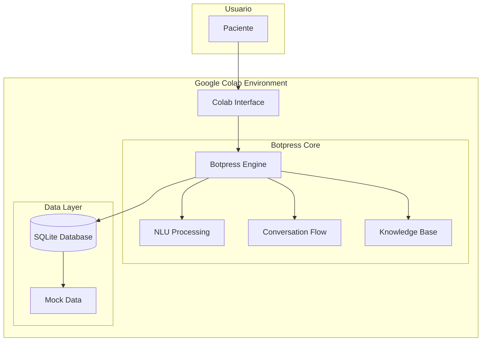
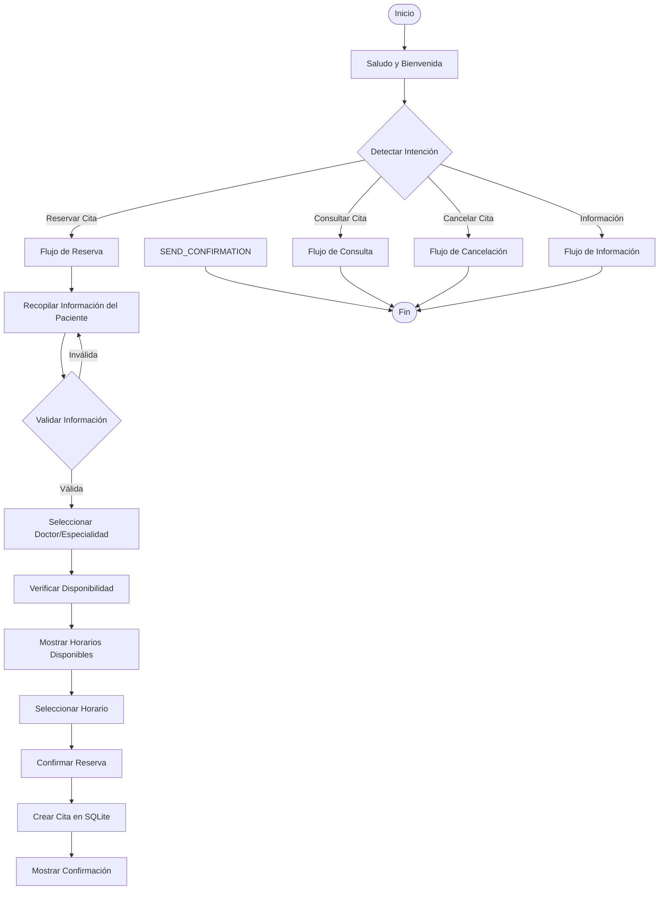
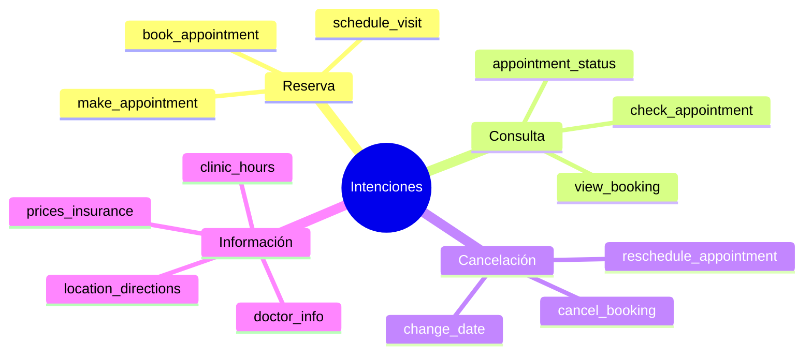
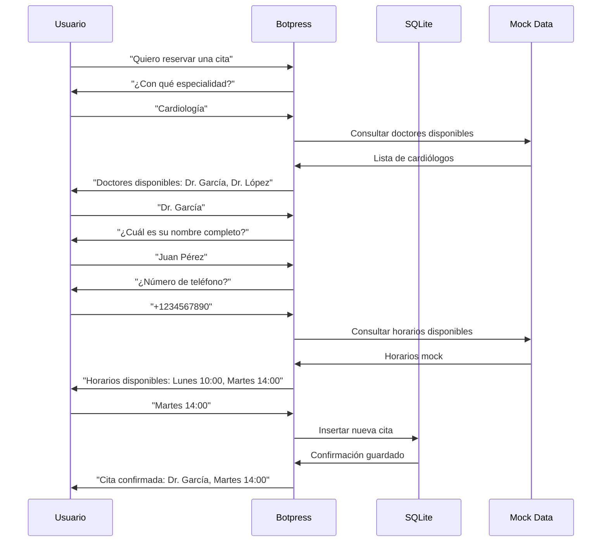
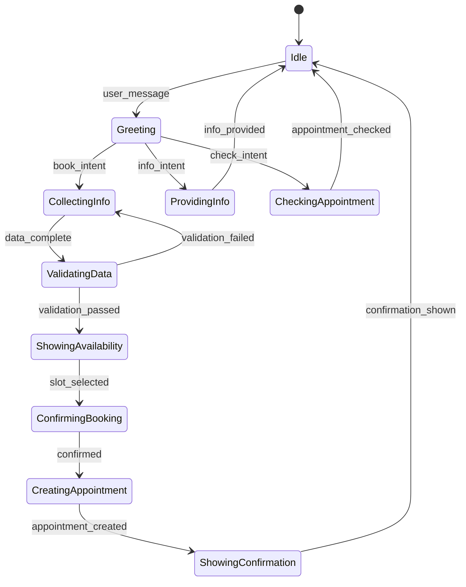
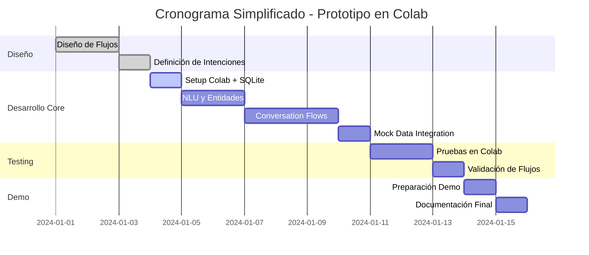

# Chatbot para Reservas de Citas Médicas - Documento de Diseño

## 1. Alcance y Requerimientos del Chatbot

### 1.1 Objetivo Principal
Desarrollar un chatbot inteligente para la reserva de citas médicas que permita a los pacientes:
- Programar citas de manera autónoma
- Consultar disponibilidad en tiempo real
- Recibir confirmaciones y recordatorios
- Reagendar o cancelar citas existentes

### 1.2 Objetivos de Aprendizaje
- Aprender desarrollo de chatbots con Botpress
- Dominar NLU (Natural Language Understanding) y flujos conversacionales
- Implementar base de datos SQLite en Google Colab
- Crear un prototipo funcional simple y efectivo

### 1.3 Requerimientos Funcionales
- **RF001**: El chatbot debe permitir reservar citas médicas
- **RF002**: Debe mostrar disponibilidad de doctores y horarios
- **RF003**: Debe solicitar información básica del paciente
- **RF004**: Debe confirmar la cita por mensaje
- **RF005**: Debe permitir reagendar citas existentes
- **RF006**: Debe manejar consultas básicas sobre citas

### 1.4 Requerimientos No Funcionales
- **RNF001**: Cumplimiento con regulaciones de privacidad (GDPR, HIPAA)
- **RNF002**: Tiempo de respuesta menor a 3 segundos
- **RNF003**: Disponibilidad 24/7
- **RNF004**: Interfaz multiidioma (español/inglés)
- **RNF005**: Funcionalidad completa en Google Colab

## 2. Arquitectura del Sistema

### 2.1 Diagrama de Arquitectura General



### 2.2 Componentes del Sistema

#### 2.2.1 Botpress Core
- Motor principal del chatbot
- Gestión de sesiones y contexto
- Procesamiento de mensajes
- Enrutamiento de conversaciones

#### 2.2.2 NLU Engine (Natural Language Understanding)
- Reconocimiento de intenciones
- Extracción de entidades
- Análisis de sentimientos
- Clasificación de consultas

#### 2.2.3 Conversation Flow
- Flujos de diálogo estructurados
- Gestión de estados de conversación
- Validación de inputs
- Manejo de errores

#### 2.2.4 Knowledge Base
- Información sobre doctores y especialidades (mock data)
- Horarios de atención simulados
- Datos básicos de consulta
- Respuestas predefinidas para FAQs

## 3. Diseño del Flujo Conversacional

### 3.1 Flujo Principal de Reserva de Citas



### 3.2 Intenciones y Entidades

#### 3.2.1 Intenciones Principales


#### 3.2.2 Entidades Clave
- **@doctor**: Nombres de doctores
- **@specialty**: Especialidades médicas
- **@date**: Fechas de citas
- **@time**: Horarios específicos
- **@patient_info**: Datos del paciente
- **@appointment_id**: Identificadores de citas

## 4. Implementación Técnica

### 4.1 Stack Tecnológico Simplificado
- **Plataforma**: Botpress (Open Source)
- **NLU**: Botpress NLU Engine
- **Base de Datos**: SQLite (compatible con Colab)
- **Desarrollo y Testing**: Google Colab
- **Datos**: Mock data para doctores y horarios
- **Enfoque**: Core NLU y Conversation Flows

### 4.2 Configuración de Botpress en Google Colab

```python
# Instalación y configuración inicial para Google Colab
!pip install botpress-sdk sqlite3

# Importaciones necesarias
import sqlite3
import json
import datetime
from botpress_sdk import Client

# Configuración básica
BOTPRESS_TOKEN = "your_token_here"

# Inicialización del cliente y base de datos
client = Client(token=BOTPRESS_TOKEN)
db_connection = sqlite3.connect('hospital_appointments.db')

# Crear tablas básicas
cursor = db_connection.cursor()
cursor.execute('''
    CREATE TABLE IF NOT EXISTS appointments (
        id INTEGER PRIMARY KEY AUTOINCREMENT,
        patient_name TEXT NOT NULL,
        patient_phone TEXT,
        doctor_name TEXT NOT NULL,
        specialty TEXT NOT NULL,
        date TEXT NOT NULL,
        time TEXT NOT NULL,
        status TEXT DEFAULT 'confirmed',
        created_at TIMESTAMP DEFAULT CURRENT_TIMESTAMP
    )
''')
db_connection.commit()
```

### 4.3 Estructura de Intenciones

```json
{
  "intents": [
    {
      "name": "book_appointment",
      "utterances": [
        "Quiero reservar una cita",
        "Necesito agendar con un doctor",
        "Programar consulta médica"
      ],
      "slots": [
        {
          "name": "specialty",
          "entity": "@specialty"
        },
        {
          "name": "preferred_date",
          "entity": "@date"
        }
      ]
    }
  ]
}
```

## 5. Flujos de Conversación Detallados

### 5.1 Flujo de Recopilación de Información



### 5.2 Estados de Conversación



## 6. Base de Conocimiento

### 6.1 Mock Data - Información Médica
```python
mock_doctors = {
    "Cardiología": ["Dr. García", "Dr. López"],
    "Dermatología": ["Dra. Martínez", "Dr. Rodríguez"],
    "Pediatría": ["Dra. Fernández", "Dr. Sánchez"]
}

mock_schedules = {
    "Dr. García": ["Lunes 10:00", "Martes 14:00", "Miércoles 16:00"],
    "Dr. López": ["Lunes 09:00", "Jueves 15:00", "Viernes 11:00"]
}
```

### 6.2 Datos Operativos Simplificados
- **Horarios**: Mock data con horarios fijos
- **Especialidades**: Lista predefinida básica
- **Confirmaciones**: Respuestas de texto simple
- **Consultas**: Búsquedas en SQLite local

## 7. Integración y Despliegue

### 7.1 Calendario de Desarrollo



### 7.2 Enfoque de Implementación Simplificado

#### 7.2.1 Google Colab (Único Objetivo Inicial)
- Desarrollo completo en notebook
- Base de datos SQLite local
- Interfaz de chat simple en Colab
- Testing y validación en mismo entorno
- Demo funcional sin dependencias externas

#### 7.2.2 Componentes Removidos (Fases Futuras)
- ~~WhatsApp Business integration~~
- ~~Email/SMS notifications~~
- ~~Payment processing~~
- ~~External calendar APIs~~
- ~~Web deployment~~

## 8. Criterios de Evaluación

### 8.1 Funcionalidad del Chatbot (40%)
- ✅ Reserva exitosa de citas
- ✅ Manejo de múltiples especialidades
- ✅ Validación de datos del paciente
- ✅ Integración con sistema de calendario
- ✅ Confirmaciones automáticas

### 8.2 Flujo Conversacional (30%)
- ✅ Respuestas naturales y coherentes
- ✅ Manejo de errores y excepciones
- ✅ Recuperación de contexto
- ✅ Escalamiento a humanos cuando sea necesario

### 8.3 Integración y Despliegue (20%)
- ✅ Funcionalidad completa en Google Colab
- ✅ SQLite funcionando correctamente
- ✅ Mock data integrada
- ✅ Conversación fluida sin dependencias externas

### 8.4 Presentación y Demo (10%)
- ✅ Demostración en vivo
- ✅ Documentación clara
- ✅ Video explicativo
- ✅ Casos de uso cubiertos

## 9. Plan de Implementación

### 9.1 Fase Única: Prototipo Funcional en Colab (2 Semanas)

#### Días 1-2: Setup Inicial
1. Configurar cuenta de Botpress
2. Setup Google Colab con SQLite
3. Crear base de datos y mock data
4. Primer "Hello World" funcional

#### Días 3-5: NLU y Flujos Core
1. Definir intenciones principales (book_appointment, check_appointment)
2. Configurar entidades (@doctor, @specialty, @date, @time)
3. Crear flujos de conversación básicos
4. Implementar lógica de SQLite

#### Días 6-8: Integración y Testing
1. Conectar NLU con base de datos
2. Pruebas de flujos conversacionales
3. Manejo de errores y casos edge
4. Optimización de respuestas

#### Días 9-10: Demo y Documentación
1. Preparar demo en vivo
2. Crear video demostrativo
3. Finalizar documentación
4. Validación final de requerimientos

## 10. Consideraciones de Seguridad y Privacidad

### 10.1 Cumplimiento Normativo
- **GDPR**: Consentimiento explícito para datos personales
- **HIPAA**: Protección de información médica
- **SOC 2**: Controles de seguridad organizacional

### 10.2 Medidas de Seguridad
- Encriptación de datos en tránsito y reposo
- Autenticación de dos factores
- Logs de auditoría
- Respaldo automático de datos

### 10.3 Manejo de Datos Sensibles
- Minimización de datos recopilados
- Anonimización cuando sea posible
- Políticas claras de retención
- Procedimientos de eliminación segura

## 11. Pasos de Validación en Google Colab

### 11.1 Checklist de Validación

#### ✅ Setup y Configuración
```python
# Verificar instalación
!pip list | grep botpress
!python -c "import sqlite3; print('SQLite OK')"

# Verificar base de datos
conn = sqlite3.connect('hospital_appointments.db')
cursor = conn.cursor()
cursor.execute("SELECT name FROM sqlite_master WHERE type='table';")
print(cursor.fetchall())
```

#### ✅ Test de NLU
```python
# Test de intenciones
test_phrases = [
    "Quiero reservar una cita",
    "Necesito agendar con cardiología", 
    "¿Qué citas tengo?"
]

for phrase in test_phrases:
    intent = client.detect_intent(phrase)
    print(f"{phrase} -> {intent}")
```

#### ✅ Test de Flujo Conversacional
```python
# Simular conversación completa
conversation_test = [
    "Hola",
    "Quiero reservar una cita",
    "Cardiología",
    "Juan Pérez", 
    "+1234567890",
    "Dr. García",
    "Martes 14:00"
]

for message in conversation_test:
    response = chatbot.process_message(message)
    print(f"User: {message}")
    print(f"Bot: {response}\n")
```

#### ✅ Test de Base de Datos
```python
# Verificar inserción de citas
cursor.execute("SELECT * FROM appointments ORDER BY created_at DESC LIMIT 5")
recent_appointments = cursor.fetchall()
print("Últimas 5 citas:")
for apt in recent_appointments:
    print(apt)
```

### 11.2 Criterios de Éxito
- ✅ Bot responde correctamente a saludo inicial
- ✅ Detecta intención de "reservar cita" 
- ✅ Solicita información del paciente paso a paso
- ✅ Muestra doctores disponibles según especialidad
- ✅ Permite seleccionar horarios disponibles
- ✅ Guarda cita en SQLite correctamente
- ✅ Confirma cita con todos los detalles
- ✅ Maneja errores de entrada inválida

## 12. Conclusiones y Enfoque Simplificado

Este diseño simplificado se enfoca en los aspectos core del desarrollo de chatbots: **NLU, Conversation Flows y manejo de datos**. Al eliminar integraciones complejas, el aprendizaje se concentra en dominar Botpress y crear una experiencia conversacional sólida.

### Beneficios del Enfoque Simplificado:
1. **Aprendizaje Focused**: Dominio de NLU y flujos conversacionales
2. **Rápida Iteración**: Testing inmediato en Colab
3. **Sin Dependencias**: Funciona completamente offline
4. **Base Sólida**: Fundación para futuras expansiones

---

*Documento de diseño simplificado - Versión 2.0 (Colab-First)*